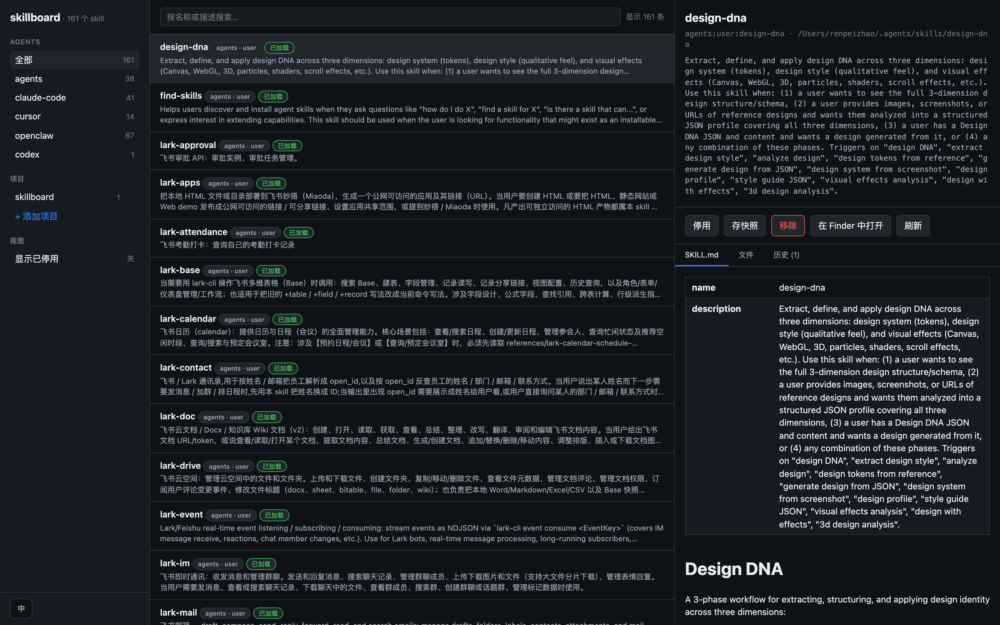

# skillboard

> 一个本地仪表盘，把散落在 Claude Code / Codex / Cursor / openclaw 中的 skills 统一管起来。

[](https://www.npmjs.com/package/@laylaren/skillboard)
[](https://www.npmjs.com/package/@laylaren/skillboard)
[](./LICENSE)

[English](./README.md)



## 它能做什么

- **跨 Agent 清单**——一次性扫描 `~/.claude/skills`、`~/.codex/skills`、`~/.cursor/skills-cursor`、`~/.openclaw/skills`，以及你授权的项目级 `.claude/skills/` 目录。
- **识别重复和阴影**——同名 skill 出现在多个 Agent 或多个作用域时，告诉你"哪一份真正被加载"，哪些是分叉副本。
- **安全合并**——内容完全相同的冲突，一键收敛为单一规范源（其余位置替换为 symlink），垃圾桶可撤销。
- **版本历史开箱即用**——每次外部编辑、安装、启用、停用、手动快照都会落到 `~/.skillboard/versions/` 下每个 skill 一个 git repo，一键回滚。

## 快速开始

```bash
git clone https://github.com/laylaren/skillboard.git
cd skillboard
npm install      # `prepare` 钩子会自动构建 SPA
npm run serve    # → ✓ skillboard dashboard at http://127.0.0.1:7300
```

浏览器打开 <http://127.0.0.1:7300>。`--no-open` 跳过自动开浏览器；`--port <n>` 改默认端口（7300）。

## 通过 npm 安装

免 clone 直接运行：

```bash
npx @laylaren/skillboard          # 在 http://127.0.0.1:7300 启动仪表盘
```

或全局安装 `skillboard` 命令：

```bash
npm install -g @laylaren/skillboard
skillboard serve                  # 启动仪表盘
skillboard ls                     # 在终端列出 skills
```

## 支持的 Agent

| Agent       | User 作用域                       | Project / Workspace 作用域         |
| ----------- | -------------------------------- | ---------------------------------- |
| Claude Code | `~/.claude/skills/`              | `<project>/.claude/skills/`        |
| Codex       | `~/.codex/skills/`                 | `<project>/.codex/skills/`           |
| Cursor      | `~/.cursor/skills-cursor/`       | `<project>/.cursor/skills-cursor/` |
| openclaw    | `~/.openclaw/skills/` (`system`) | `~/.openclaw/workspace/skills/` (`workspace`) |

Claude Code 的 plugin 自带 skill（`~/.claude/plugins/cache/.../skills/`）以只读形式展示——修改请走 `/plugin`。

## 平台支持

| 平台 | 状态 | 说明 |
| --- | --- | --- |
| macOS | 完全支持 | 主开发平台，全部功能端到端验证过。 |
| Linux | 应该可用 | 代码跨平台，但没经过充分实测。"在文件管理器中显示"只能开父目录、不高亮文件（xdg-open 限制）。 |
| Windows | 大部分可用 | 基本功能没问题，但 `safe-merge` 要创建 symlink，Windows 上需要管理员权限或开启 Developer Mode。 |
| Windows + WSL2 | Windows 用户推荐 | 行为等同 Linux，没有 symlink 权限问题。 |

## 数据存在哪

所有本地状态在 `~/.skillboard/` 下：

- `~/.skillboard/projects.json` —— 你授权扫描的项目列表
- `~/.skillboard/versions/` —— 每个 skill 一个的 bare git 仓库（历史）
- `~/.skillboard/trash/` —— 移除 skill 时的兜底回收站

没有遥测、除浏览器访问 `127.0.0.1` 之外没有任何网络调用、不需要账号。

## 开发

```bash
npm run web:dev    # Vite dev server with HMR（终端 1）
npm run serve      # Fastify API（终端 2）—— 走 Vite proxy 或直接消费 build 产物
npm run typecheck  # 全 workspace 跑 tsc -b
```

仓库是 npm workspaces monorepo：

- `packages/core` —— 扫描器、Agent 适配器、版本管理、文件监听
- `packages/server` —— Fastify REST + 静态 SPA host
- `packages/web` —— React SPA（构建产物在发布时夹带进 `@skillboard/server` 包）
- `packages/cli` —— `skillboard` 二进制

## 贡献

欢迎 Issue 和 PR。暂无正式的 `CONTRIBUTING.md`，代码量一个下午能读完。

## License

[MIT](./LICENSE)
